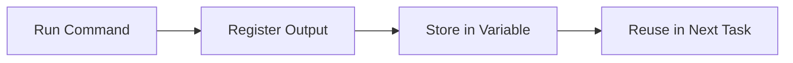

# Lab 08 - Registered Variables in Ansible

> **Course:** Ansible for Beginners
>
> **Lab Duration:** 90 Minutes
>
> **Difficulty:** ⭐⭐ Beginner

---

# Lab Objectives

After completing this lab, you will be able to:

- Understand what Registered Variables are.
- Store the output of a task.
- Display stored output.
- Understand `stdout`, `stderr`, `rc`, `changed`, and `stdout_lines`.
- Use Registered Variables in subsequent tasks.
- Build dynamic playbooks using command output.

---

# Prerequisites

Complete the following labs before starting:

- Lab 01 - Environment Setup
- Lab 02 - Inventory
- Lab 03 - Ad-hoc Commands
- Lab 04 - First Playbook
- Lab 05 - Variables
- Lab 06 - Variable Files
- Lab 07 - Ansible Facts

---

# Lab Architecture



---

# What are Registered Variables?

Suppose you execute a Linux command.

```bash
date
```

Output

```
Tue Jul 01 10:45:18 UTC 2026
```

Normally,

Ansible displays the output and then forgets it.

What if you want to use the output later?

For example,

- Display it again.
- Save it into a report.
- Make a decision based on the output.

This is where **Registered Variables** are used.

---

# Definition

A Registered Variable stores the output of a task.

Think of it like a container.

```
Command

↓

Output

↓

Register

↓

Variable

↓

Reuse Later
```

---

# Syntax

```yaml
register: variable_name
```

Example

```yaml
register: current_date
```

---

# Lab 1 - Store the Output of the date Command

Move to your working directory.

```bash
cd ~/ansible-labs
```

Create a playbook.

```bash
nano register.yml
```

Paste the following.

```yaml
---
- name: Register Demo

  hosts: servers

  tasks:

    - name: Execute date command

      command: date

      register: current_date

    - name: Display Output

      debug:

        var: current_date.stdout
```

Save the file.

---

# Understanding the Playbook

## command module

```yaml
command: date
```

Runs the Linux `date` command on the managed node.

---

## register

```yaml
register: current_date
```

Stores the command output inside a variable named

```
current_date
```

---

## debug

```yaml
debug:
```

Displays the stored value.

---

## stdout

```yaml
current_date.stdout
```

Displays only the standard output of the command.

---

# Step 2 - Run the Playbook

```bash
ansible-playbook -i inventory.ini register.yml
```

---

# Expected Output

```
TASK [Execute date command]

changed

TASK [Display Output]

Tue Jul 01 10:45:18 UTC 2026
```

---

# What Happened?

Ansible executed

```
date
```

The output

```
Tue Jul 01 10:45:18 UTC 2026
```

was stored inside

```
current_date
```

Then

```
current_date.stdout
```

displayed the stored output.

---

# Lab 2 - View Everything Inside a Registered Variable

Modify the second task.

```yaml
- debug:

    var: current_date
```

Run again.

---

# Expected Output

```
current_date:

changed: true

cmd:

- date

stdout:

Tue Jul 01 10:45:18 UTC 2026

stderr:

rc: 0

start:

end:

delta:
```

Notice that the registered variable stores much more than just the command output.

---

# Understanding Registered Variable Structure

```
current_date

|

|-- stdout

|-- stdout_lines

|-- stderr

|-- stderr_lines

|-- rc

|-- changed

|-- cmd

|-- start

|-- end

|-- delta
```

---

# Understanding Each Field

## stdout

The normal output produced by the command.

Example

```
Tue Jul 01 10:45:18 UTC 2026
```

---

## stderr

Displays error messages.

Normally empty if the command succeeds.

---

## rc

Return Code.

```
0
```

means success.

Any non-zero value indicates an error.

---

## changed

Indicates whether Ansible considers the task to have changed the remote system.

```
true

or

false
```

---

## start

Time when the command started.

---

## end

Time when the command finished.

---

## delta

Execution time.

Example

```
0:00:00.004
```

---

# Lab 3 - Display Multiple Registered Values

Modify the playbook.

```yaml
---
- name: Register Demo

  hosts: servers

  tasks:

    - command: date

      register: current_date

    - debug:

        msg:

          - "Output : {{ current_date.stdout }}"

          - "Return Code : {{ current_date.rc }}"

          - "Changed : {{ current_date.changed }}"
```

---

Run

```bash
ansible-playbook -i inventory.ini register.yml
```

---

# Expected Output

```
Output : Tue Jul 01 10:45:18 UTC 2026

Return Code : 0

Changed : true
```

---

# Lab 4 - Register the hostname Command

Replace the command.

```yaml
command: hostname
```

Register

```yaml
register: hostname_output
```

Display

```yaml
hostname_output.stdout
```

Run the playbook.

Expected Output

```
client-node
```

---

# Lab 5 - Register the uptime Command

Replace

```yaml
command: uptime
```

Register

```yaml
register: uptime_output
```

Display

```yaml
uptime_output.stdout
```

Expected Output

```
11:02:31 up 3 days, 2 users, load average...
```

---

# Lab 6 - Register the free Command

Execute

```yaml
command: free -m
```

Register

```yaml
register: memory
```

Display

```yaml
memory.stdout
```

Expected Output

```
total used free shared buff/cache available
```

---

# Lab 7 - Using stdout_lines

Instead of one long string,

split the output into multiple lines.

Example

```yaml
- command: free -m

  register: memory

- debug:

    var: memory.stdout_lines
```

Expected Output

```
[
"total used free shared ...",

"Mem: ....",

"Swap: ...."
]
```

---

# stdout vs stdout_lines

## stdout

Returns one string.

```
line1
line2
line3
```

---

## stdout_lines

Returns a list.

```
line1

line2

line3
```

Useful when processing multi-line output.

---

# Lab 8 - Register the whoami Command

Create a playbook.

```yaml
---
- name: Current User

  hosts: servers

  tasks:

    - command: whoami

      register: user

    - debug:

        var: user.stdout
```

Run

```bash
ansible-playbook -i inventory.ini register.yml
```

---

# Commonly Registered Commands

| Command | Purpose |
|----------|----------|
| hostname | Host Name |
| date | Current Date |
| uptime | System Uptime |
| whoami | Current User |
| free -m | Memory Information |
| df -h | Disk Usage |
| uname -r | Kernel Version |
| ip addr | Network Information |

---

# Common Mistakes

## Wrong

```yaml
debug:

  var: stdout
```

Correct

```yaml
debug:

  var: current_date.stdout
```

---

## Wrong

Using a registered variable before it has been created.

Always execute the task first.

---

## Wrong

Misspelled variable name.

```yaml
currentdate.stdout
```

Correct

```yaml
current_date.stdout
```

---

# Best Practices

✔ Use meaningful register names.

Good

```yaml
hostname_output
```

Better than

```yaml
x
```

---

✔ Register only when required.

Avoid registering unnecessary commands.

---

✔ Display only required fields.

Instead of

```yaml
var: current_date
```

use

```yaml
var: current_date.stdout
```

when you only need the output.

---

# Lab Exercise 1

Execute

```bash
uname -r
```

using Ansible.

Store the output.

Display

```
stdout

rc

changed
```

---

# Lab Exercise 2

Execute

```bash
df -h
```

Store the output.

Display

```
stdout_lines
```

---

# Challenge Lab

Create a playbook that executes:

```
hostname

date

uptime

whoami
```

Store each output using different Registered Variables.

Display all the values as a formatted report.

Example

```
====================================

SERVER REPORT

====================================

Hostname :

Current Date :

Current User :

System Uptime :

====================================
```

---

# Verification Checklist

Verify that you can:

- Register command output.
- Display stdout.
- Display stdout_lines.
- Display rc.
- Display changed.
- Display stderr.
- Use multiple Registered Variables.

---

# Viva Questions

### 1. What is a Registered Variable?

---

### 2. Which keyword stores task output?

---

### 3. What is stdout?

---

### 4. What is stderr?

---

### 5. What does rc mean?

---

### 6. What is stdout_lines?

---

### 7. Can Registered Variables be reused?

---

### 8. Which module displays Registered Variables?

---

### 9. What does `changed: true` indicate?

---

### 10. When should you use Registered Variables?

---

# Summary

Congratulations!

In this lab, you learned how to:

- Store command output using `register`.
- Access `stdout`, `stdout_lines`, `stderr`, `rc`, and `changed`.
- Reuse command output in later tasks.
- Build dynamic playbooks using Registered Variables.
- Understand the internal structure of a Registered Variable.

Registered Variables are an essential feature in Ansible because they allow playbooks to capture and reuse information generated during execution.

---

# Next Lab

➡ **Lab 09 – Conditional Statements (`when`)**

In the next lab, you will learn:

- What conditional statements are.
- Using the `when` keyword.
- Making decisions based on Ansible Facts.
- Making decisions using Registered Variables.
- Creating intelligent and dynamic playbooks.
