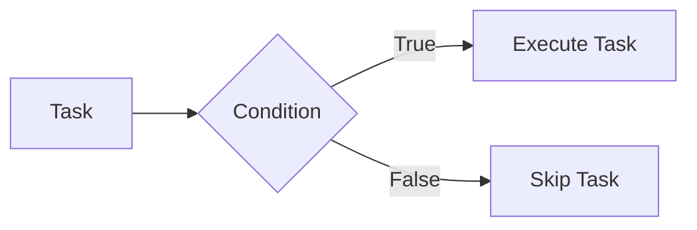

# Lab 09 - Conditional Statements (`when`) - Part 1

> **Course:** Ansible for Beginners
>
> **Lab Duration:** 90 Minutes
>
> **Difficulty:** ⭐⭐ Beginner

---

# Lab Objectives

After completing this lab, you will be able to:

- Understand Conditional Statements.
- Understand the purpose of the `when` keyword.
- Execute tasks only when a condition is true.
- Use Variables in Conditions.
- Use Ansible Facts in Conditions.
- Create intelligent playbooks.

---

# Prerequisites

Complete the following labs before starting.

- Lab 01 - Environment Setup
- Lab 02 - Inventory
- Lab 03 - Ad-hoc Commands
- Lab 04 - First Playbook
- Lab 05 - Variables
- Lab 06 - Variable Files
- Lab 07 - Ansible Facts
- Lab 08 - Registered Variables

---

# Lab Architecture



---

# What are Conditional Statements?

Imagine you have two Linux servers.

| Server | Operating System |
|----------|------------------|
| Server 1 | Ubuntu |
| Server 2 | Rocky Linux |

You want to install

```
nginx
```

only on Ubuntu.

Should Ansible execute the task on Rocky Linux?

No.

It should skip that task.

This decision-making capability is called a **Conditional Statement**.

---

# Definition

A Conditional Statement tells Ansible

> "Execute this task only if the condition is true."

If the condition is false,

Ansible skips the task.

---

# Real World Example

Suppose your company has

- Ubuntu Servers
- RedHat Servers
- Rocky Linux Servers
- Debian Servers

The package manager differs.

Ubuntu

```
apt
```

RedHat

```
dnf
```

Rocky

```
dnf
```

Without conditions,

one playbook cannot support multiple operating systems.

Conditional statements solve this problem.

---

# The `when` Keyword

Ansible uses

```yaml
when:
```

to create conditions.

Syntax

```yaml
- name: Task Name

  module:

  when: condition
```

---

# How `when` Works

```
Condition

↓

TRUE

↓

Task Executes

-----------------

Condition

↓

FALSE

↓

Task Skipped
```

---

# Lab 1 - First Conditional Statement

Create a new playbook.

```bash
nano when.yml
```

Paste the following.

```yaml
---
- name: First Condition

  hosts: servers

  vars:

    course: DevOps

  tasks:

    - name: Display Course

      debug:

        msg: "{{ course }}"

      when: course == "DevOps"
```

Save the file.

---

# Understanding the Playbook

Variable

```yaml
course: DevOps
```

Condition

```yaml
when: course == "DevOps"
```

Meaning

"If course equals DevOps,

execute the task."

---

# Step 2 - Execute

Run

```bash
ansible-playbook -i inventory.ini when.yml
```

---

# Expected Output

```
TASK [Display Course]

ok

msg:

DevOps
```

---

# What Happened?

Condition

```
course == "DevOps"
```

Result

```
TRUE
```

Therefore

the task executed.

---

# Lab 2 - False Condition

Modify

```yaml
course: Linux
```

Do NOT modify the condition.

Run

```bash
ansible-playbook -i inventory.ini when.yml
```

---

# Expected Output

```
TASK [Display Course]

skipping
```

---

# Why Was It Skipped?

Variable

```
Linux
```

Condition

```
DevOps
```

Comparison

```
Linux == DevOps
```

Result

```
FALSE
```

Therefore

Ansible skipped the task.

---

# Lab 3 - Using Variables in Conditions

Create

```yaml
---
- name: Package Demo

  hosts: servers

  vars:

    package_name: nginx

  tasks:

    - name: Install Package

      debug:

        msg: "Installing {{ package_name }}"

      when: package_name == "nginx"
```

Run

```bash
ansible-playbook -i inventory.ini when.yml
```

---

# Expected Output

```
Installing nginx
```

---

Now change

```yaml
package_name: apache2
```

Run again.

Expected Output

```
skipping
```

---

# Using Facts in Conditions

One of the most common uses of `when`

is with Ansible Facts.

For example,

only execute a task if

the operating system is Ubuntu.

---

# Lab 4 - Ubuntu Check

Create

```yaml
---
- name: Ubuntu Check

  hosts: servers

  gather_facts: yes

  tasks:

    - name: Ubuntu Message

      debug:

        msg: "This machine is running Ubuntu."

      when: ansible_distribution == "Ubuntu"
```

---

Run

```bash
ansible-playbook -i inventory.ini when.yml
```

---

# Expected Output (Ubuntu)

```
This machine is running Ubuntu.
```

---

# Expected Output (Rocky Linux)

```
skipping
```

---

# Understanding the Condition

Fact

```yaml
ansible_distribution
```

Possible values

```
Ubuntu

Debian

Rocky

RedHat

CentOS
```

Condition

```yaml
when: ansible_distribution == "Ubuntu"
```

Meaning

Execute only on Ubuntu systems.

---

# Lab 5 - Display Different Messages

Replace the playbook.

```yaml
---
- name: Distribution Demo

  hosts: servers

  gather_facts: yes

  tasks:

    - name: Display Distribution

      debug:

        msg: "{{ ansible_distribution }}"
```

Run the playbook.

Observe your client's operating system.

Now modify the playbook.

```yaml
---
- name: Ubuntu Demo

  hosts: servers

  gather_facts: yes

  tasks:

    - name: Ubuntu Server

      debug:

        msg: "Ubuntu Server Detected"

      when: ansible_distribution == "Ubuntu"

    - name: Debian Server

      debug:

        msg: "Debian Server Detected"

      when: ansible_distribution == "Debian"
```

---

# Expected Output

If your client is Ubuntu

```
Ubuntu Server Detected

TASK Debian

skipping
```

If your client is Debian

```
TASK Ubuntu

skipping

Debian Server Detected
```

---

# Comparison Operators

| Operator | Meaning |
|----------|---------|
| == | Equal To |
| != | Not Equal To |
| > | Greater Than |
| < | Less Than |
| >= | Greater Than or Equal To |
| <= | Less Than or Equal To |

Example

```yaml
when: ansible_distribution == "Ubuntu"
```

---

# Common Mistakes

Wrong

```yaml
when: ansible_distribution = Ubuntu
```

Correct

```yaml
when: ansible_distribution == "Ubuntu"
```

---

Wrong

```yaml
when: course == DevOps
```

Correct

```yaml
when: course == "DevOps"
```

---

Wrong

```yaml
when: ansible_distribution=="Ubuntu"
```

Although valid, it is recommended to add spaces for better readability:

```yaml
when: ansible_distribution == "Ubuntu"
```

---

# Verification Checklist

Verify that you can:

- Create a condition using variables.
- Create a condition using Facts.
- Execute tasks only when the condition is true.
- Observe skipped tasks.
- Compare string values using `==`.

---

# Lab Exercise 1

Create a variable

```yaml
environment: Production
```

Display

```
Production Server
```

only if

```
environment == "Production"
```

---

# Lab Exercise 2

Display

```
Linux Server
```

only if

```
ansible_distribution == "Ubuntu"
```

---

# Mini Challenge

Create one playbook with three tasks.

Task 1

Display

```
Hostname
```

Task 2

Display

```
Operating System
```

Task 3

Display

```
This is an Ubuntu Server
```

only if

```
ansible_distribution == "Ubuntu"
```

---

# Summary

Congratulations!

In this lab, you learned:

- What Conditional Statements are.
- Why `when` is used.
- Creating simple conditions.
- Using Variables in Conditions.
- Using Ansible Facts in Conditions.
- Executing tasks only when conditions are true.

---

# Next Lab (Part 2)

In Part 2, you will learn:

- Using Registered Variables in Conditions
- Multiple Conditions (`and`, `or`, `not`)
- Numeric Comparisons (`>`, `<`, `>=`, `<=`)
- Complex Real-World Examples
- Best Practices
- Troubleshooting
- Challenge Lab
- Viva Questions
