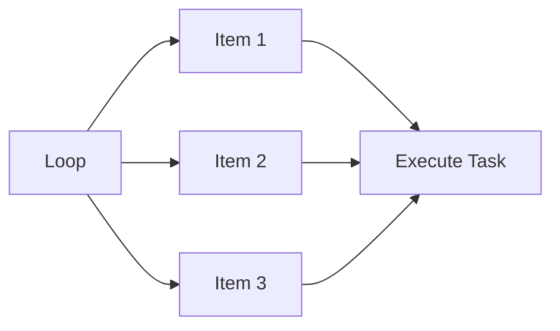

# Lab 10 - Loops in Ansible (Part 1)

> **Course:** Ansible for Beginners
>
> **Lab Duration:** 90 Minutes
>
> **Difficulty:** ⭐⭐ Beginner

---

# Lab Objectives

After completing this lab, you will be able to:

- Understand what loops are.
- Understand why loops are used.
- Use the `loop` keyword.
- Understand the `item` variable.
- Display multiple values using a loop.
- Use variables with loops.
- Write cleaner and shorter playbooks.

---

# Prerequisites

Complete the following labs before starting.

- Lab 01 - Environment Setup
- Lab 02 - Inventory
- Lab 03 - Ad-hoc Commands
- Lab 04 - First Playbook
- Lab 05 - Variables
- Lab 06 - Variable Files
- Lab 07 - Ansible Facts
- Lab 08 - Registered Variables
- Lab 09 - Conditional Statements

---

# Lab Architecture



---

# What is a Loop?

Suppose you want to display three names.

Without a loop, you would write:

```yaml
- debug:
    msg: "John"

- debug:
    msg: "David"

- debug:
    msg: "Justin"
```

The same task is repeated three times.

This creates unnecessary code.

A loop allows Ansible to repeat the same task automatically for multiple values.

---

# Definition

A loop tells Ansible:

> **"Execute the same task repeatedly for each item in a list."**

Instead of writing the same task many times, you write it only once.

---

# Real-World Example

Imagine you need to install five packages on every server.

```
nginx

git

curl

vim

tree
```

Without loops,

you would create five separate tasks.

With loops,

you create only one task.

---

# Without Loop

```yaml
- name: Install nginx

  apt:

    name: nginx

    state: present

- name: Install git

  apt:

    name: git

    state: present

- name: Install curl

  apt:

    name: curl

    state: present
```

---

# With Loop

```yaml
- name: Install Packages

  apt:

    name: "{{ item }}"

    state: present

  loop:

    - nginx

    - git

    - curl
```

One task.

Multiple executions.

---

# Understanding the `item` Variable

Whenever Ansible executes a loop,

it automatically creates a temporary variable called

```yaml
item
```

During each iteration,

`item` contains one value from the list.

Example

```
Loop List

↓

nginx

git

curl
```

Execution

```
Iteration 1

item = nginx

Iteration 2

item = git

Iteration 3

item = curl
```

---

# Lab 1 - Your First Loop

Move to your Ansible working directory.

```bash
cd ~/ansible-labs
```

Create a new playbook.

```bash
nano loop.yml
```

Paste the following.

```yaml
---
- name: First Loop Demo

  hosts: servers

  tasks:

    - name: Display Names

      debug:

        msg: "{{ item }}"

      loop:

        - Justin

        - David

        - John
```

Save the file.

---

# Understanding the Playbook

The `debug` task executes once for each item in the list.

Iteration 1

```
item = Justin
```

Iteration 2

```
item = David
```

Iteration 3

```
item = John
```

---

# Step 2 - Run the Playbook

```bash
ansible-playbook -i inventory.ini loop.yml
```

---

# Expected Output

```
TASK [Display Names]

ok:

msg: Justin

ok:

msg: David

ok:

msg: John
```

---

# What Happened?

Although there is only one task,

Ansible executed it three times.

Each execution used a different value from the list.

---

# Lab 2 - Display Programming Languages

Replace the list.

```yaml
loop:

  - Python

  - Java

  - C

  - Go

  - Rust
```

Run the playbook again.

---

# Expected Output

```
Python

Java

C

Go

Rust
```

---

# Lab 3 - Display Linux Distributions

Modify the playbook.

```yaml
---
- name: Linux Distributions

  hosts: servers

  tasks:

    - debug:

        msg: "{{ item }}"

      loop:

        - Ubuntu

        - Debian

        - Rocky

        - AlmaLinux

        - CentOS
```

Run the playbook.

Observe the output.

---

# Lab 4 - Using Variables with Loops

Instead of writing the list inside the loop,

store it in a variable.

```yaml
---
- name: Loop with Variables

  hosts: servers

  vars:

    packages:

      - nginx

      - git

      - curl

      - vim

  tasks:

    - debug:

        msg: "{{ item }}"

      loop: "{{ packages }}"
```

---

# Why Use Variables?

Imagine you have a list of 20 packages.

Instead of modifying the loop every time,

you only update the variable.

This makes the playbook easier to maintain.

---

# Expected Output

```
nginx

git

curl

vim
```

---

# Lab 5 - Display Custom Messages

Modify the playbook.

```yaml
---
- name: Custom Messages

  hosts: servers

  vars:

    students:

      - Alice

      - Bob

      - Charlie

  tasks:

    - name: Welcome Students

      debug:

        msg: "Welcome {{ item }} to the DevOps course!"

      loop: "{{ students }}"
```

---

# Expected Output

```
Welcome Alice to the DevOps course!

Welcome Bob to the DevOps course!

Welcome Charlie to the DevOps course!
```

---

# Understanding How the Loop Works

```
students

↓

Alice

↓

Welcome Alice

-----------------

Bob

↓

Welcome Bob

-----------------

Charlie

↓

Welcome Charlie
```

The same task executes once for each student.

---

# Loop Syntax

```yaml
loop:

  - value1

  - value2

  - value3
```

Or

```yaml
vars:

  packages:

    - nginx

    - git

loop: "{{ packages }}"
```

---

# Common Mistakes

## Wrong Indentation

Wrong

```yaml
loop:

- nginx
```

Correct

```yaml
loop:

  - nginx
```

---

## Forgetting Double Curly Braces

Wrong

```yaml
msg: item
```

Correct

```yaml
msg: "{{ item }}"
```

---

## Wrong Variable Name

Wrong

```yaml
loop: "{{ package }}"
```

Correct

```yaml
loop: "{{ packages }}"
```

---

# Best Practices

✔ Use loops whenever the same task repeats.

✔ Store long lists in variables.

✔ Use meaningful variable names.

✔ Keep lists organized.

✔ Use loops to reduce duplicate code.

---

# Verification Checklist

Verify that you can:

- Create a loop.
- Use the `item` variable.
- Display multiple values.
- Use variables with loops.
- Read loop output.

---

# Lab Exercise 1

Create a loop that displays:

```
Linux

Docker

Git

Ansible

Kubernetes
```

---

# Lab Exercise 2

Create a variable called

```yaml
courses
```

Store

```
Linux

Python

DevOps

AWS
```

Display each course using a loop.

---

# Lab Exercise 3

Create a variable called

```yaml
cities
```

Store five city names.

Display

```
Welcome to <city>
```

for each city.

Example

```
Welcome to Kochi

Welcome to Bengaluru

Welcome to Chennai
```

---

# Mini Challenge

Create a playbook that displays the following report.

```
==================================

Available Services

==================================

nginx

mysql

docker

jenkins

==================================
```

Use a loop to display each service.

---

# Summary

Congratulations!

In this lab, you learned:

- What loops are.
- Why loops are useful.
- The `loop` keyword.
- The `item` variable.
- Using variables with loops.
- Displaying multiple values with a single task.

By using loops, you can significantly reduce duplicate code and make your Ansible playbooks cleaner, easier to maintain, and more scalable.

---

# Next (Part 2)

In Part 2, you will learn:

- Installing Multiple Packages
- Creating Multiple Users
- Creating Multiple Directories
- Creating Multiple Files
- Registering Loop Results
- Using Loops with Conditions (`when`)
- Best Practices
- Troubleshooting
- Challenge Lab
- Viva Questions
