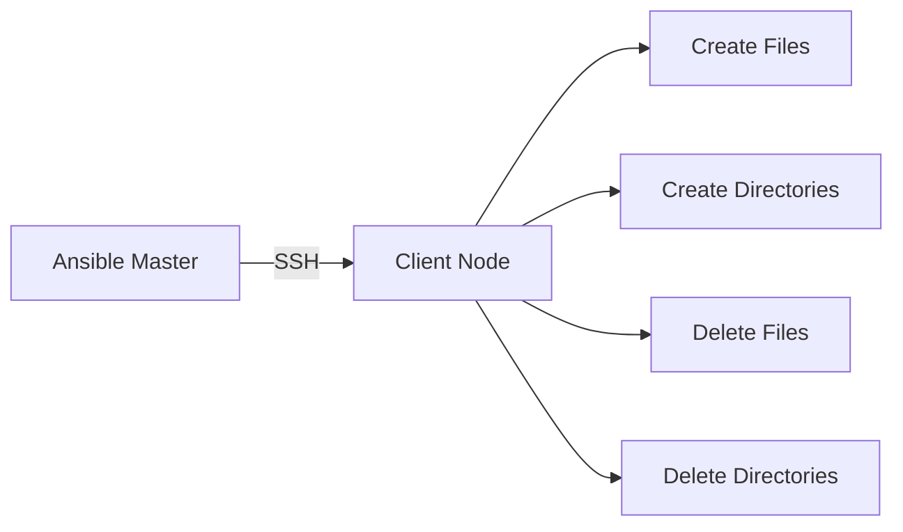

# Lab 11 - File Module (Part 1)

> **Course:** Ansible for Beginners
>
> **Lab Duration:** 90 Minutes
>
> **Difficulty:** ⭐⭐ Beginner

---

# Lab Objectives

After completing this lab, you will be able to:

- Understand the purpose of the File Module.
- Create files.
- Create directories.
- Delete files.
- Delete directories.
- Understand different file states.
- Verify file operations on managed nodes.

---

# Prerequisites

Complete the following labs before starting.

- Lab 01 - Environment Setup
- Lab 02 - Inventory
- Lab 03 - Ad-hoc Commands
- Lab 04 - First Playbook
- Lab 05 - Variables
- Lab 06 - Variable Files
- Lab 07 - Ansible Facts
- Lab 08 - Registered Variables
- Lab 09 - Conditional Statements
- Lab 10 - Loops

---

# Lab Architecture



---

# What is the File Module?

The **File Module** is used to manage files, directories, and symbolic links on remote Linux systems.

Unlike the **Copy Module**, it **does not copy file contents**.

Instead, it manages the properties and state of files and directories.

---

# Why Do We Use the File Module?

System administrators frequently need to:

- Create log directories
- Create empty files
- Delete temporary files
- Remove old directories
- Set permissions
- Create symbolic links

The File Module automates these tasks.

---

# Syntax

```yaml
- name: Manage File

  file:

    path: /path/to/file

    state: touch
```

---

# Common File States

| State | Description |
|--------|-------------|
| touch | Create an empty file |
| directory | Create a directory |
| absent | Remove a file or directory |
| file | Ensure a file exists (without creating it if absent) |
| link | Create a symbolic link |
| hard | Create a hard link |

> **Note:** In this lab, we will focus on `touch`, `directory`, and `absent`. Links will be covered in Part 2.

---

# Lab 1 - Creating an Empty File

Move to your Ansible working directory.

```bash
cd ~/ansible-labs
```

Create a new playbook.

```bash
nano create-file.yml
```

Paste the following.

```yaml
---
- name: Create Empty File

  hosts: servers

  become: yes

  tasks:

    - name: Create app.log

      file:

        path: /tmp/app.log

        state: touch
```

Save the file.

---

# Understanding the Playbook

### `path`

Specifies the location of the file.

```yaml
path: /tmp/app.log
```

---

### `state: touch`

Creates an empty file if it does not exist.

If the file already exists,

Ansible updates its timestamp without creating a duplicate.

---

# Step 2 - Execute the Playbook

```bash
ansible-playbook -i inventory.ini create-file.yml
```

---

# Expected Output

```
TASK [Create app.log]

changed: [client]
```

---

# Verify on Client Node

Login to the client.

```bash
ssh student@client
```

Verify.

```bash
ls -l /tmp/app.log
```

Expected Output

```
-rw-r--r-- 1 root root 0 Jul 10 10:15 /tmp/app.log
```

---

# Understanding Idempotency

Run the playbook again.

```bash
ansible-playbook -i inventory.ini create-file.yml
```

You may see:

```
ok: [client]
```

or

```
changed: [client]
```

depending on whether the timestamp was updated.

Ansible avoids creating duplicate files.

---

# Lab 2 - Creating Multiple Empty Files

Instead of writing multiple tasks,

combine the File Module with a loop.

```yaml
---
- name: Create Multiple Files

  hosts: servers

  become: yes

  tasks:

    - name: Create Log Files

      file:

        path: "{{ item }}"

        state: touch

      loop:

        - /tmp/app.log

        - /tmp/error.log

        - /tmp/access.log
```

---

# Run

```bash
ansible-playbook -i inventory.ini create-file.yml
```

---

# Verify

```bash
ls -l /tmp/*.log
```

---

# Lab 3 - Creating a Directory

Create a new playbook.

```bash
nano create-directory.yml
```

Paste.

```yaml
---
- name: Create Directory

  hosts: servers

  become: yes

  tasks:

    - name: Create Project Directory

      file:

        path: /opt/project

        state: directory
```

---

# Understanding `state: directory`

If the directory does not exist,

Ansible creates it.

If it already exists,

Ansible leaves it unchanged.

---

# Run

```bash
ansible-playbook -i inventory.ini create-directory.yml
```

---

# Verify

```bash
ls -ld /opt/project
```

Expected Output

```
drwxr-xr-x root root ...
```

---

# Lab 4 - Creating Multiple Directories

```yaml
---
- name: Create Directories

  hosts: servers

  become: yes

  tasks:

    - name: Create Application Directories

      file:

        path: "{{ item }}"

        state: directory

      loop:

        - /opt/project

        - /opt/scripts

        - /opt/logs
```

---

# Verify

```bash
ls -ld /opt/project
```

```bash
ls -ld /opt/scripts
```

```bash
ls -ld /opt/logs
```

---

# Lab 5 - Deleting a File

Create a new playbook.

```bash
nano delete-file.yml
```

Paste.

```yaml
---
- name: Delete File

  hosts: servers

  become: yes

  tasks:

    - name: Delete app.log

      file:

        path: /tmp/app.log

        state: absent
```

---

# Understanding `state: absent`

When using

```yaml
state: absent
```

Ansible removes the specified file or directory.

If the file does not exist,

Ansible completes successfully without an error.

---

# Run

```bash
ansible-playbook -i inventory.ini delete-file.yml
```

---

# Verify

```bash
ls /tmp/app.log
```

Expected Output

```
No such file or directory
```

---

# Lab 6 - Deleting a Directory

Create a new playbook.

```bash
nano delete-directory.yml
```

Paste.

```yaml
---
- name: Delete Directory

  hosts: servers

  become: yes

  tasks:

    - name: Delete Project Directory

      file:

        path: /opt/project

        state: absent
```

---

# Run

```bash
ansible-playbook -i inventory.ini delete-directory.yml
```

---

# Verify

```bash
ls -ld /opt/project
```

Expected Output

```
No such file or directory
```

---

# Understanding File States

| State | Action |
|--------|--------|
| touch | Create empty file |
| directory | Create directory |
| absent | Delete file or directory |

---

# Best Practices

✔ Use meaningful task names.

✔ Verify results after execution.

✔ Use loops for repetitive file operations.

✔ Use `become: yes` when managing system directories.

---

# Common Mistakes

## Incorrect Path

Wrong

```yaml
path: tmp/app.log
```

Correct

```yaml
path: /tmp/app.log
```

---

## Missing Privileges

Creating directories under `/opt` usually requires root privileges.

Use

```yaml
become: yes
```

---

## Incorrect State

Wrong

```yaml
state: folder
```

Correct

```yaml
state: directory
```

---

# Verification Checklist

Verify that you can:

- Create an empty file.
- Create multiple files.
- Create a directory.
- Create multiple directories.
- Delete a file.
- Delete a directory.

---

# Lab Exercise 1

Create the following files.

```
/tmp/config.txt

/tmp/users.txt

/tmp/readme.txt
```

---

# Lab Exercise 2

Create the following directories.

```
/opt/apps

/opt/config

/opt/backups
```

---

# Lab Exercise 3

Delete the following.

```
/tmp/config.txt

/opt/apps
```

Verify the results.

---

# Mini Challenge

Create a playbook that:

1. Creates:

```
/opt/devops
```

2. Creates:

```
/opt/devops/logs

/opt/devops/scripts
```

3. Creates:

```
/opt/devops/logs/app.log

/opt/devops/logs/error.log
```

Use loops wherever appropriate.

---

# Summary

Congratulations!

In this lab, you learned how to:

- Create files using the File Module.
- Create directories.
- Delete files.
- Delete directories.
- Understand `touch`, `directory`, and `absent`.
- Combine the File Module with loops.
- Verify file operations on managed nodes.

These operations form the foundation for managing files and directories with Ansible.

---

# Next (Part 2)

In Part 2, you will learn:

- File permissions (`mode`)
- Owner and Group
- Symbolic Links
- Hard Links
- Advanced File Module usage
- Best Practices
- Troubleshooting
- Challenge Lab
- Viva Questions
