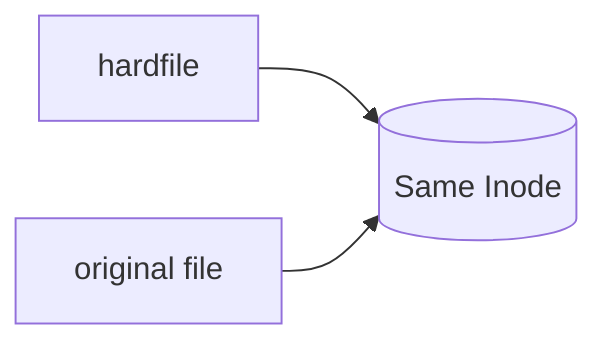

---

# Lab 14 - Creating Symbolic Links

## What is a Symbolic Link?

A **symbolic link (symlink)** is a special file that points to another file or directory.

It works like a shortcut in Windows.

Instead of storing the actual data, it stores the path to another file.

For example,

```
/opt/app/config.conf
```

can have a symbolic link

```
/etc/myapp.conf
```

Both refer to the same target file.

---

## Why Use Symbolic Links?

System administrators commonly use symbolic links to:

- Create shortcuts to files
- Maintain application compatibility
- Point configuration files to a standard location
- Manage software versions

Example

```
/opt/nginx-1.28/

↓

Current Version

↓

/opt/nginx
```

Applications always use

```
/opt/nginx
```

even when the actual version changes.

---

# Symbolic Link Architecture

```mermaid
graph LR

A[/etc/myapp.conf]

A --> B[/opt/project/config.conf]
```

---

# Lab 15 - Create a Symbolic Link

## Step 1 - Create the Target File

```bash
nano symlink.yml
```

Paste the following.

```yaml
---
- name: Create Symbolic Link

  hosts: servers

  become: yes

  tasks:

    - name: Create Target File

      file:

        path: /tmp/application.log

        state: touch

    - name: Create Symbolic Link

      file:

        src: /tmp/application.log

        dest: /tmp/app.log

        state: link
```

---

## Understanding the Parameters

### src

The original file.

```yaml
src: /tmp/application.log
```

---

### dest

The symbolic link that will be created.

```yaml
dest: /tmp/app.log
```

---

### state

```yaml
state: link
```

tells Ansible to create a symbolic link.

---

## Step 2 - Execute

```bash
ansible-playbook -i inventory.ini symlink.yml
```

---

## Verify

```bash
ls -l /tmp/app.log
```

Expected

```
lrwxrwxrwx

app.log -> /tmp/application.log
```

Notice the arrow

```
->
```

which indicates a symbolic link.

---

## Verify Further

Display the contents.

```bash
cat /tmp/app.log
```

Since the target file is empty,

the output will also be empty.

---

# Lab 16 - Removing a Symbolic Link

Modify the playbook.

```yaml
---
- name: Remove Symbolic Link

  hosts: servers

  become: yes

  tasks:

    - name: Delete Link

      file:

        path: /tmp/app.log

        state: absent
```

---

## Execute

```bash
ansible-playbook -i inventory.ini symlink.yml
```

---

## Verify

```bash
ls -l /tmp/app.log
```

Expected

```
No such file or directory
```

The original file

```
/tmp/application.log
```

still exists.

Verify

```bash
ls -l /tmp/application.log
```

---

# Lab 17 - Creating a Hard Link

## What is a Hard Link?

Unlike a symbolic link,

a hard link points directly to the file's inode.

Both names refer to the same physical file.

Deleting one name does not remove the file as long as another hard link exists.

---

# Hard Link Architecture



---

# Lab 18 - Create a Hard Link

Create

```bash
nano hardlink.yml
```

Paste

```yaml
---
- name: Hard Link Demo

  hosts: servers

  become: yes

  tasks:

    - name: Create Original File

      file:

        path: /tmp/data.txt

        state: touch

    - name: Create Hard Link

      file:

        src: /tmp/data.txt

        dest: /tmp/data_backup.txt

        state: hard
```

---

## Execute

```bash
ansible-playbook -i inventory.ini hardlink.yml
```

---

## Verify

```bash
ls -li /tmp/data*
```

Expected

```
123456 data.txt

123456 data_backup.txt
```

Notice

Both files have the **same inode number**.

---

# Symbolic Link vs Hard Link

| Feature | Symbolic Link | Hard Link |
|----------|---------------|-----------|
| Points To | File Path | Inode |
| Cross Filesystem | Yes | No |
| Can Link Directories | Yes | No (generally) |
| Broken if Original Deleted | Yes | No |
| Linux Command | `ln -s` | `ln` |

---

# Lab 19 - Creating Multiple Directories Using Loops

The File Module works very well with loops.

```yaml
---
- name: Directory Loop

  hosts: servers

  become: yes

  vars:

    directories:

      - /opt/project

      - /opt/scripts

      - /opt/logs

  tasks:

    - name: Create Directories

      file:

        path: "{{ item }}"

        state: directory

        mode: "0755"

      loop: "{{ directories }}"
```

---

## Execute

```bash
ansible-playbook -i inventory.ini directory-loop.yml
```

---

## Verify

```bash
ls -ld /opt/project
```

```bash
ls -ld /opt/scripts
```

```bash
ls -ld /opt/logs
```

---

# Lab 20 - Creating Multiple Files Using Loops

```yaml
---
- name: File Loop

  hosts: servers

  become: yes

  vars:

    files:

      - /tmp/app.log

      - /tmp/error.log

      - /tmp/access.log

  tasks:

    - name: Create Files

      file:

        path: "{{ item }}"

        state: touch

        mode: "0644"

      loop: "{{ files }}"
```

---

## Execute

```bash
ansible-playbook -i inventory.ini file-loop.yml
```

---

## Verify

```bash
ls -l /tmp/*.log
```

---

# Why Combine Loops with the File Module?

Suppose you need to create:

```
20 directories

15 log files

10 configuration folders
```

Without loops,

you would need dozens of repetitive tasks.

Using loops,

one task can manage many files or directories.

This makes playbooks:

- Shorter
- Easier to maintain
- Easier to read
- Less error-prone

---

# Verification Checklist

Verify that you can:

- Create a symbolic link.
- Remove a symbolic link.
- Create a hard link.
- Identify the difference between symbolic and hard links.
- Use loops with the File Module.
- Verify links using `ls -l` and `ls -li`.

---

# Continue to Part 2B-2

In the final part, you will learn:

- Best Practices
- Common Mistakes
- Troubleshooting
- Lab Exercises
- Challenge Lab
- Viva Questions
- Summary

---

# Best Practices

Following best practices helps create playbooks that are secure, readable, and easy to maintain.

### 1. Use Absolute Paths

Always use complete file paths.

✔ Correct

```yaml
path: /opt/project/app.conf
```

✘ Incorrect

```yaml
path: app.conf
```

---

### 2. Use the Least Required Permission

Avoid giving unnecessary permissions.

Preferred

```yaml
mode: "0644"
```

Avoid

```yaml
mode: "0777"
```

unless absolutely required.

---

### 3. Use Meaningful Task Names

Instead of

```yaml
- name: Task 1
```

Use

```yaml
- name: Create Application Log Directory
```

This makes playbooks easier to understand.

---

### 4. Combine Loops with the File Module

Instead of repeating tasks,

use loops.

Example

```yaml
vars:

  directories:

    - /opt/app

    - /opt/logs

    - /opt/config

tasks:

  - name: Create Directories

    file:

      path: "{{ item }}"

      state: directory

    loop: "{{ directories }}"
```

---

### 5. Verify Every Change

Always verify after execution.

Examples

```bash
ls -l
```

```bash
ls -ld
```

```bash
stat filename
```

---

# Common Mistakes

## Mistake 1 - Missing Root Privileges

Example

```yaml
file:

  path: /opt/project

  state: directory
```

Result

```
Permission denied
```

Solution

```yaml
become: yes
```

---

## Mistake 2 - Invalid State

Wrong

```yaml
state: folder
```

Correct

```yaml
state: directory
```

---

## Mistake 3 - Incorrect Permission

Wrong

```yaml
mode: "999"
```

Correct

```yaml
mode: "0755"
```

---

## Mistake 4 - Incorrect Owner

Wrong

```yaml
owner: application
```

when the user does not exist.

Verify

```bash
id application
```

before changing ownership.

---

## Mistake 5 - Wrong Destination for Symbolic Link

Always ensure the source file exists before creating the link.

---

# Troubleshooting

## Problem 1

```
Permission denied
```

Check

```yaml
become: yes
```

---

## Problem 2

```
No such file or directory
```

Verify

```bash
ls
```

Confirm the path is correct.

---

## Problem 3

Symbolic link is broken.

Verify

```bash
ls -l
```

Check whether the original file still exists.

---

## Problem 4

Owner not changed.

Verify

```bash
id username
```

Ensure the specified user exists.

---

## Problem 5

Unexpected permissions.

Check

```bash
stat filename
```

Example

```bash
stat /tmp/application.log
```

This displays:

- Owner
- Group
- Permission
- Inode
- Modification time

---

# Verification Checklist

Before completing this lab, ensure that you can:

- Create files.
- Create directories.
- Delete files.
- Delete directories.
- Set permissions.
- Change owner.
- Change group.
- Create symbolic links.
- Create hard links.
- Use loops with the File Module.
- Verify your changes.

---

# Lab Exercise 1

Create the following directory structure.

```
/opt/devops

/opt/devops/config

/opt/devops/scripts

/opt/devops/logs
```

Set

```
Permission

755
```

---

# Lab Exercise 2

Inside

```
/opt/devops/logs
```

create

```
app.log

error.log

access.log
```

using a loop.

---

# Lab Exercise 3

Create

```
/tmp/report.txt
```

Create a symbolic link

```
/tmp/report_latest.txt
```

Verify

```bash
ls -l /tmp/report*
```

---

# Lab Exercise 4

Create

```
/tmp/data.txt
```

Create a hard link

```
/tmp/data_backup.txt
```

Verify

```bash
ls -li /tmp/data*
```

Ensure both files have the same inode number.

---

# Challenge Lab

Create a playbook named

```bash
system-setup.yml
```

The playbook should perform the following tasks.

## Step 1

Create directories.

```
/opt/company

/opt/company/config

/opt/company/logs

/opt/company/scripts
```

---

## Step 2

Create files.

```
application.log

error.log

access.log
```

inside

```
/opt/company/logs
```

---

## Step 3

Set permissions.

Directories

```
0755
```

Files

```
0644
```

---

## Step 4

Create a symbolic link.

```
/opt/company/current.log
```

↓

```
/opt/company/logs/application.log
```

---

## Step 5

Display the following message.

```
====================================

SYSTEM INITIALIZATION COMPLETED

Directories Created

Files Created

Permissions Applied

Symbolic Link Created

====================================
```

---

# Real-World Scenario

Imagine you are configuring a new application server.

Before deploying the application, you must:

- Create application directories.
- Create log directories.
- Create configuration directories.
- Create empty log files.
- Assign the correct permissions.
- Assign the correct ownership.
- Create symbolic links expected by the application.

The Ansible File Module automates all these repetitive administrative tasks consistently across multiple servers.

---

# Viva Questions

### 1. What is the purpose of the File Module?

---

### 2. Which state creates an empty file?

---

### 3. Which state creates a directory?

---

### 4. Which state deletes a file?

---

### 5. What does `mode: "0755"` mean?

---

### 6. What is the difference between a symbolic link and a hard link?

---

### 7. Why should `0777` generally be avoided?

---

### 8. Which parameter changes file ownership?

---

### 9. Why is `become: yes` required for many File Module tasks?

---

### 10. How can you verify file permissions on Linux?

---

# Summary

Congratulations!

In this lab, you learned how to use the Ansible **File Module** to manage files and directories on remote Linux systems.

You learned to:

- Create files using `state: touch`
- Create directories using `state: directory`
- Remove files and directories using `state: absent`
- Set file and directory permissions with `mode`
- Change file ownership using `owner`
- Change group ownership using `group`
- Create symbolic links using `state: link`
- Create hard links using `state: hard`
- Combine loops with the File Module
- Troubleshoot common issues and follow best practices

The **File Module** is one of the most frequently used Ansible modules because nearly every automation project involves creating directories, managing configuration files, setting permissions, or preparing the filesystem before deploying applications.

---

# Key Takeaways

✅ The File Module manages **filesystem objects**, not file contents.

✅ Use:

- `touch` → Create empty files
- `directory` → Create directories
- `absent` → Remove files/directories
- `link` → Create symbolic links
- `hard` → Create hard links

✅ Use `mode`, `owner`, and `group` to control access.

✅ Combine loops with the File Module to reduce repetitive code.

✅ Always verify your changes on the managed node.

---

# Next Lab

➡ **Lab 12 – Copy Module**

In the next lab, you will learn:

- Copying files from the Ansible control node to managed nodes
- Setting ownership and permissions while copying
- Backing up existing files
- Copying multiple files using loops
- Using the Copy Module in real-world deployments
