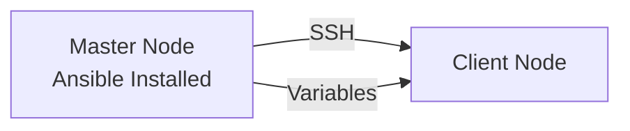

# Lab 05 - Ansible Variables

> **Course:** Ansible for Beginners
>
> **Lab Duration:** 60-90 Minutes
>
> **Difficulty:** ⭐ Beginner

---

# Lab Objectives

After completing this lab, you will be able to:

- Understand what variables are.
- Understand why variables are used.
- Create variables inside a playbook.
- Display variables using the `debug` module.
- Modify variables without changing the tasks.
- Use multiple variables in a playbook.
- Understand variable interpolation using Jinja2.

---

# Prerequisites

Before starting this lab, ensure you have completed:

- Lab 01 - Environment Setup
- Lab 02 - Inventory
- Lab 03 - Ad-hoc Commands
- Lab 04 - First Playbook

Your lab environment should contain:

| Machine | Purpose |
|----------|----------|
| Master Node | Ansible Control Node |
| Client Node | Managed Node |

---

# Lab Architecture



---

# What are Variables?

Variables are containers that store values.

Instead of writing the same value repeatedly, we store it once inside a variable and reuse it whenever required.

Think of variables like labels on boxes.

Example:

Instead of writing

```
nginx
```

many times,

store it as

```yaml
package_name: nginx
```

Now whenever you need the package name, simply use

```yaml
{{ package_name }}
```

---

# Why do we use Variables?

Imagine you have a playbook with 100 tasks.

Every task installs or configures **nginx**.

Later your company decides to use **Apache** instead.

Without variables:

You must edit 100 different places.

With variables:

You only modify one line.

This saves:

- Time
- Effort
- Errors

---

# Variable Syntax

Variables are written using Jinja2 syntax.

```
{{ variable_name }}
```

Example

```yaml
msg: "{{ package_name }}"
```

Ansible replaces the variable with its value.

If

```yaml
package_name: nginx
```

Output becomes

```
nginx
```

---

# Lab 1 - Creating Your First Variable

## Step 1

Move to your Ansible working directory.

```bash
cd ~/ansible-labs
```

---

## Step 2

Create a new playbook.

```bash
nano variables.yml
```

---

## Step 3

Paste the following code.

```yaml
---
- name: Variables Demo
  hosts: servers

  vars:
    package_name: nginx

  tasks:

    - name: Display Package Name
      debug:
        msg: "{{ package_name }}"
```

Save the file.

```
CTRL + O
Enter
CTRL + X
```

---

## Understanding the Playbook

### hosts

```yaml
hosts: servers
```

Runs the playbook on all hosts inside the **servers** inventory group.

---

### vars

```yaml
vars:
    package_name: nginx
```

Creates a variable called

```
package_name
```

whose value is

```
nginx
```

---

### debug module

```yaml
debug:
```

The debug module prints messages on the screen.

It is mainly used for learning and troubleshooting.

---

### msg

```yaml
msg: "{{ package_name }}"
```

Displays the value stored in the variable.

---

# Step 4

Run the playbook.

```bash
ansible-playbook -i inventory.ini variables.yml
```

---

# Expected Output

```
PLAY [Variables Demo]

TASK [Gathering Facts]
ok

TASK [Display Package Name]

ok:

msg: nginx

PLAY RECAP

client : ok=2
```

---

# What Happened?

Ansible looked for

```
{{ package_name }}
```

It found

```yaml
package_name: nginx
```

Therefore it displayed

```
nginx
```

---

# Lab 2 - Changing Variable Value

Open the playbook again.

```bash
nano variables.yml
```

Change

```yaml
package_name: nginx
```

to

```yaml
package_name: apache2
```

Save the file.

Run

```bash
ansible-playbook -i inventory.ini variables.yml
```

---

# Expected Output

```
apache2
```

Notice:

You changed only **one line**.

The rest of the playbook remains unchanged.

---

# Lab 3 - Creating Multiple Variables

Replace the playbook with

```yaml
---
- name: Multiple Variables Demo
  hosts: servers

  vars:

    trainer: Justin

    course: DevOps

    package_name: nginx

  tasks:

    - name: Display Trainer
      debug:
        msg: "{{ trainer }}"

    - name: Display Course
      debug:
        msg: "{{ course }}"

    - name: Display Package
      debug:
        msg: "{{ package_name }}"
```

---

Run

```bash
ansible-playbook -i inventory.ini variables.yml
```

---

# Expected Output

```
Justin

DevOps

nginx
```

---

# Understanding the Output

Each task prints one variable.

Task 1

```
Justin
```

Task 2

```
DevOps
```

Task 3

```
nginx
```

---

# Lab 4 - Displaying Variables in One Message

Modify the playbook.

```yaml
---
- name: Variables Demo
  hosts: servers

  vars:

    trainer: Justin

    course: DevOps

    package_name: nginx

  tasks:

    - name: Display Information
      debug:

        msg:

          - "Trainer : {{ trainer }}"

          - "Course : {{ course }}"

          - "Package : {{ package_name }}"
```

---

Run

```bash
ansible-playbook -i inventory.ini variables.yml
```

---

# Expected Output

```
Trainer : Justin

Course : DevOps

Package : nginx
```

---

# Understanding Jinja2

Anything inside

```
{{ }}
```

is evaluated by Ansible.

Example

```yaml
{{ trainer }}
```

becomes

```
Justin
```

Example

```yaml
{{ package_name }}
```

becomes

```
nginx
```

---

# Common Mistakes

## Wrong

```yaml
msg: { package_name }
```

Wrong brackets.

---

## Wrong

```yaml
msg: "{{package_name}"
```

Missing bracket.

---

## Wrong

```yaml
msg: "{{ Package_Name }}"
```

Variable names are case-sensitive.

---

## Correct

```yaml
msg: "{{ package_name }}"
```

---

# Variable Naming Rules

Good variable names

```yaml
package_name

service_name

user_name

course
```

Avoid

```yaml
Package

1package

user-name

user name
```

---

# Best Practices

Use meaningful variable names.

Good

```yaml
web_package
```

Better than

```yaml
pkg
```

---

Keep variable names lowercase.

Good

```yaml
package_name
```

Avoid

```yaml
Package_Name
```

---

Use underscores instead of spaces.

Correct

```yaml
service_name
```

Wrong

```yaml
service name
```

---

# Lab Exercise 1

Create variables

```
student_name

college

branch
```

Display

```
Student :

College :

Branch :
```

---

# Lab Exercise 2

Create variables

```
city

state

country
```

Display

```
Location:

City :

State :

Country :
```

---

# Challenge Lab

Create a playbook that displays

```
Trainer

Course

Institute

Package

Service

Environment
```

using variables.

---

# Verification Checklist

Verify that you can:

- Create variables.
- Display variables.
- Modify variable values.
- Create multiple variables.
- Display multiple variables together.
- Use Jinja2 syntax correctly.

---

# Viva Questions

### 1. What is a variable?

---

### 2. Why do we use variables?

---

### 3. What is Jinja2 syntax?

---

### 4. Which module is used to display variables?

---

### 5. What is the syntax for accessing a variable?

---

### 6. Can one playbook have multiple variables?

---

### 7. Are variable names case-sensitive?

---

### 8. What happens if a variable does not exist?

---

# Summary

In this lab you learned:

- What variables are.
- Why variables are useful.
- Creating variables using `vars`.
- Displaying variables with the `debug` module.
- Using multiple variables.
- Using Jinja2 syntax (`{{ variable_name }}`).
- Following variable naming best practices.

---

# Next Lab

➡️ **Lab 06 - Variable Files**

In the next lab, you will learn how to move variables into separate YAML files using `vars_files`, making playbooks cleaner and easier to maintain.
